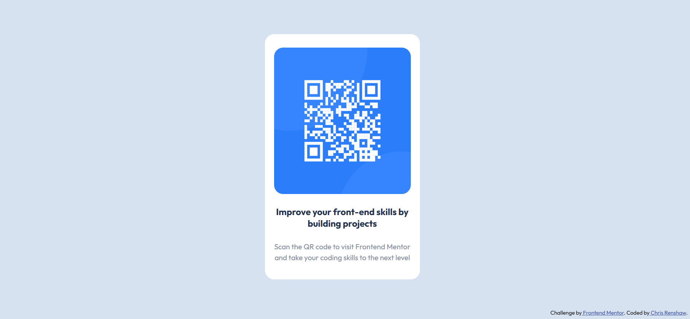

# Frontend Mentor - QR code component solution

This is a solution to the [QR code component challenge on Frontend Mentor](https://www.frontendmentor.io/challenges/qr-code-component-iux_sIO_H). Frontend Mentor challenges help you improve your coding skills by building realistic projects.

## Table of contents

- [Frontend Mentor - QR code component solution](#frontend-mentor---qr-code-component-solution)
  - [Table of contents](#table-of-contents)
  - [Overview](#overview)
    - [Screenshot](#screenshot)
    - [Links](#links)
  - [My process](#my-process)
    - [Built with](#built-with)
    - [Continued development](#continued-development)
    - [Useful resources](#useful-resources)
  - [Author](#author)

## Overview

- This is my first challenge with Frontend Mentor. I have been learning backend for a few months now and, as a software engineer in my first year of coding, wanted to see how much I could remember from my earlier learning.

### Screenshot

### Links

- Solution URL: [https://github.com/renners7777/FEM_QRCodeComponentSolution](https://github.com/renners7777/FEM_QRCodeComponentSolution)
- Live Site URL: [https://crqrcodesolution.netlify.app/](https://crqrcodesolution.netlify.app/)

## My process

- It has been a while since I have actually written any html or css code so, in order to get my head into gear, I looked at all the Frontend Mentor files in the directory and considered the different elements of the code.
- I started with the html elements and made the decision to use a card structure for the main section.
- I decided to use Flexbox as this seems the best fit for this task, which largely consisted of centering all elements on the page.

### Built with

- Semantic HTML5 markup
- CSS custom properties
- Flexbox

### Continued development

I still have a lot to learn about the intricacies of Flexbox so will keep coming back to this topic as required.

### Useful resources

- [A Complete Guide to Flexbox](https://css-tricks.com/snippets/css/a-guide-to-flexbox/) - This has always been a great resource and I hadn't used Flexbox for a while so I used it to refresh my memory.

## Author

- Website - [Chris Renshaw](https://www.chrisrenshaw.net)
- Frontend Mentor - [@renners7777](https://www.frontendmentor.io/profile/renners7777)
- Twitter - [@renners7777](https://twitter.com/renners7777)
- LinkedIn - [chris-renshaw-renners7777](https://www.linkedin.com/in/chris-renshaw-renners7777/)
